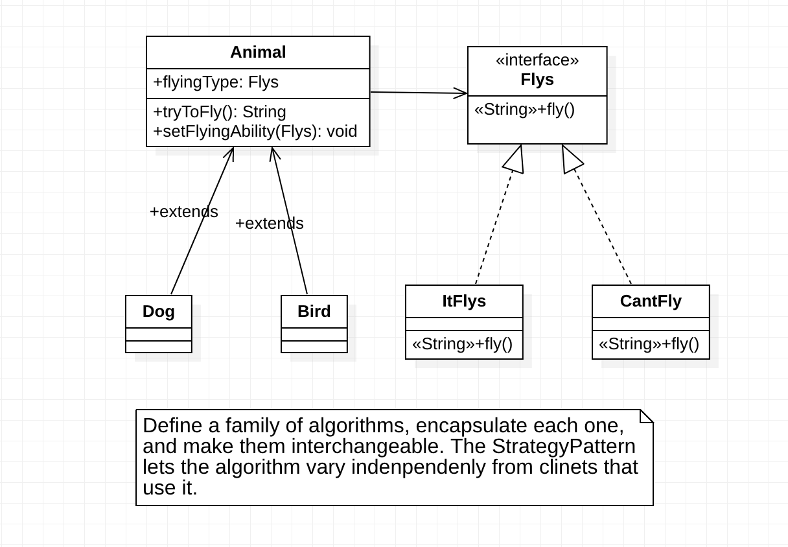

# 行为型模式

## 1.Strategy Pattern：策略模式


## 1.类图



### 2. 代码

```java
// Animal.java
public class Animal {
	
	private String name;
	private double height;
	private int weight;
	private String favFood;
	private double speed;
	private String sound;
	
	// Instead of using an interface in a traditional way
	// we use an instance variable that is a subclass
	// of the Flys interface.
	
	// Animal doesn't care what flyingType does, it just
	// knows the behavior is available to its subclasses
	
	// This is known as Composition : Instead of inheriting
	// an ability through inheritance the class is composed
	// with Objects with the right ability
	
	// Composition allows you to change the capabilities of 
	// objects at run time!
	
	public Flys flyingType;
	
	public void setName(String newName){ name = newName; }
	public String getName(){ return name; }
	
	public void setHeight(double newHeight){ height = newHeight; }
	public double getHeight(){ return height; }
	
	public void setWeight(int newWeight){ 
		if (newWeight > 0){
			weight = newWeight; 
		} else {
			System.out.println("Weight must be bigger than 0");
		}
	}
	public double getWeight(){ return weight; }
	
	public void setFavFood(String newFavFood){ favFood = newFavFood; }
	public String getFavFood(){ return favFood; }
	
	public void setSpeed(double newSpeed){ speed = newSpeed; }
	public double getSpeed(){ return speed; }
	
	public void setSound(String newSound){ sound = newSound; }
	public String getSound(){ return sound; }
	
	/* BAD
	* You don't want to add methods to the super class.
	* You need to separate what is different between subclasses
	* and the super class
	public void fly(){
		
		System.out.println("I'm flying");
		
	}
	*/
	
	// Animal pushes off the responsibility for flying to flyingType
	
	public String tryToFly(){
		
		return flyingType.fly();
		
	}
	
	// If you want to be able to change the flyingType dynamically
	// add the following method
	
	public void setFlyingAbility(Flys newFlyType){
		
		flyingType = newFlyType;
		
	}
	
}
```

```java
// Dog.java
public class Dog extends Animal{
  
	public void digHole(){
		System.out.println("Dug a hole");	
	}
	
	public Dog(){
		super();
		setSound("Bark");	
		// We set the Flys interface polymorphically
		// This sets the behavior as a non-flying Animal
		flyingType = new CantFly();
	}
	
	/* BAD
	* You could override the fly method, but we are breaking
	* the rule that we need to abstract what is different to 
	* the subclasses
	* 
	public void fly(){
		System.out.println("I can't fly");
	}
	*/
}
```

```java
// Bird.java
public class Bird extends Animal{
	// The constructor initializes all objects
	public Bird(){
		super();
		setSound("Tweet");
		// We set the Flys interface polymorphically
		// This sets the behavior as a non-flying Animal
		flyingType = new ItFlys();
	}
}
```

```java
// Flys.java
// The interface is implemented by many other
// subclasses that allow for many types of flying
// without effecting Animal, or Flys.

// Classes that implement new Flys interface
// subclasses can allow other classes to use
// that code eliminating code duplication

// I'm decoupling : encapsulating the concept that varies

public interface Flys {
	
   String fly();
   
}

// Class used if the Animal can fly

class ItFlys implements Flys{

	public String fly() {
		
		return "Flying High";
		
	}
	
}

//Class used if the Animal can't fly

class CantFly implements Flys{

	public String fly() {
		
		return "I can't fly";
		
	}
	
}
```

```java
// AnimalPlay.java
public class AnimalPlay{
	
	public static void main(String[] args){
		
		Animal sparky = new Dog();
		Animal tweety = new Bird();
		
		System.out.println("Dog: " + sparky.tryToFly());
		
		System.out.println("Bird: " + tweety.tryToFly());
		
		// This allows dynamic changes for flyingType
		
		sparky.setFlyingAbility(new ItFlys());
		
		System.out.println("Dog: " + sparky.tryToFly());
		
	}
	
}
```

### 3.什么时候用?

- When you want to define a class that have one behavior that is similarly to other behaviors in a lis
  - I want the class object to be able to choose from
    - Not flying
    - Fly with wings
    - Fly super fast
- When you need to use one of several behaviors dynamically

## 2.Template Pattern：模板方法模式

## 3.Iterator Pattern：迭代器模式

## 4.Delegate Pattern：委派模式

## 5.Observer Pattern：观察者模式

## 6.Chain Responsibility Pattern：责任链模式

## 7.Command Pattern：命令模式

## 8.Memento Pattern：备忘录模式

## 9.State Pattern：状态模式

## 10.Visitor Pattern：访问者模式

## 11.Mediator Pattern：中介者模式

## 12.Interpreter Pattern：解释器模式

